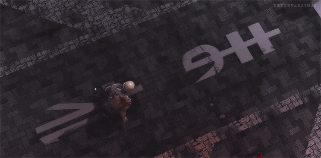

<a id="readme-top"></a>

<!-- PROJECT SHIELDS -->

[![Contributors][contributors-shield]][contributors-url]
[![Forks][forks-shield]][forks-url]
[![Stargazers][stars-shield]][stars-url]
[![Issues][issues-shield]][issues-url]
[![LinkedIn][linkedin-shield]][linkedin-url]

<!-- PROJECT LOGO -->
<br />
<div align="center">
  <a href="https://github.com/MK-DlR/messaging-app">
    
  </a>

<h3 align="center">Messaging App</h3>

  <p align="center">
    Full-stack cyberpunk messaging web app with group chats and private DMs, featuring a Guest Account for easy previewing and demoing.
    <br />
    <a href="https://github.com/MK-DlR/messaging-app"><strong>Explore the docs »</strong></a>
    <br />
    <br />
    <a href="https://messaging-app-bice-nine.vercel.app/">View Demo</a>
    &middot;
    <a href="https://github.com/MK-DlR/messaging-app/issues/new?labels=bug&template=bug-report---.md">Report Bug</a>
    &middot;
    <a href="https://github.com/MK-DlR/messaging-app/issues/new?labels=enhancement&template=feature-request---.md">Request Feature</a>
  </p>
</div>

<!-- TABLE OF CONTENTS -->
<details>
  <summary>Table of Contents</summary>
  <ol>
    <li>
      <a href="#about-the-project">About The Project</a>
      <ul>
        <li><a href="#built-with">Built With</a></li>
      </ul>
    </li>
    <li>
      <a href="#getting-started">Getting Started</a>
      <ul>
        <li><a href="#prerequisites">Prerequisites</a></li>
        <li><a href="#installation">Installation</a></li>
        <li><a href="#notes">Notes</a></li>
      </ul>
    </li>
    <li>
      <a href="#usage">Usage</a>
      <ul>
        <li><a href="#how-to-use-the-app">How to Use the App</a></li>
        <li><a href="#default-setup-behavior">Default Setup Behavior</a></li>
      </ul>
    </li>
    <li><a href="#roadmap">Roadmap</a></li>
    <li><a href="#contributing">Contributing</a></li>
    <li><a href="#contact">Contact</a></li>
    <li><a href="#acknowledgments">Acknowledgments</a></li>
  </ol>
</details>

<!-- ABOUT THE PROJECT -->

## About The Project

[![Messaging App Screen Shot][product-screenshot]](https://messaging-app-bice-nine.vercel.app/)

<p align="right">(<a href="#readme-top">back to top</a>)</p>

### Built With

- [![Express]][Express-url]
- [![Javascript][Javascript]][Javascript-url]
- [![Node.js]][Node-url]
- [![Postgres]][Postgres-url]
- [![Prisma]][Prisma-url]
- [![React][React.js]][React-url]
- [![React-router][React-router]][React-router-url]
- [![Vite]][Vite-url]

<p align="right">(<a href="#readme-top">back to top</a>)</p>

<!-- GETTING STARTED -->

## Getting Started

To get a local copy up and running, follow these steps.

### Prerequisites

- Node.js (recommended v22+)
- npm
- PostgreSQL database

### Installation

1. Clone the repository
   ```sh
   git clone https://github.com/MK-DlR/messaging-app.git
   cd messaging-app
   ```
2. Install dependencies<br />
   Frontend:
   ```sh
   cd frontend
   npm install
   ```
   Backend:
   ```sh
   cd ../backend
   npm install
   ```
3. Set up environment variables<br />
   Backend:
   ```sh
   cp backend/.env.example backend/.env
   ```
   Frontend:
   ```sh
   cp frontend/.env.example frontend/.env
   ```
   Open each `.env` file and fill in your `DATABASE_URL` and `JWT_SECRET`.
4. Set up the database<br />
   From the `backend` folder:
   ```sh
   npx prisma migrate dev --name init
   ```
5. Seed the database<br />
   Still from the `backend` folder:
   ```sh
   node prisma/seed.js
   ```
   This will create a default "Main Chat" channel and a guest user account.
6. Start the application<br />
   Backend (from `/backend`):
   ```sh
   node --watch app.js
   ```
   Frontend (from `/frontend`):
   ```sh
   npm run dev
   ```
   Start the backend before the frontend, otherwise API calls on initial load will fail.
7. Open the app
   - Frontend: `http://localhost:5173`
   - Backend: `http://localhost:3000`

### Notes

- Backend: Express + Prisma + PostgreSQL
- Frontend: React + Vite
- Authentication: JWT

<p align="right">(<a href="#readme-top">back to top</a>)</p>

<!-- USAGE EXAMPLES -->

## Usage

This is a full-stack messaging application where users can join channels and send messages (including images) to other users.

The application includes a pre-seeded database with a default channel and a guest account for quick testing.

### How to Use the App

1. Open the app at http://localhost:5173 or visit the [live demo](https://messaging-app-bice-nine.vercel.app/)
2. Register a new account or log in
   - Alternatively, use the pre-created guest account (from the seed script)
3. Select the “Main Chat” channel from the sidebar
4. Send messages in the chat input
5. Messages will appear in real time within the selected channel

### Default Setup Behavior

- A “Main Chat” channel is created automatically via the seed script
- A guest user account is also created for immediate access
- All users are automatically added to the default channel on creation

<p align="right">(<a href="#readme-top">back to top</a>)</p>

<!-- ROADMAP -->

## Roadmap

- [ ] Administrator role and functionality
- [ ] Friends list feature
- [ ] User-User blocking
- [ ] Change passwords
- [ ] Channel invitations
- [ ] Custom online status
- [ ] User-User pinging
- [ ] New message notifications
- [ ] Message direct reply
- [ ] Custom channel list organization
- [ ] Special icon for channel creators
  - [ ] Special icon for application admin/s

See the [open issues](https://github.com/MK-DlR/messaging-app/issues) for a full list of proposed features (and known issues).

<p align="right">(<a href="#readme-top">back to top</a>)</p>

<!-- CONTRIBUTING -->

## Contributing

As this is a student project created for The Odin Project curriculum, it is currently not open for contributions.

<p align="right">(<a href="#readme-top">back to top</a>)</p>

### Top contributors:

<a href="https://github.com/MK-DlR/messaging-app/graphs/contributors">
  
</a>

<!-- CONTACT -->

## Contact

Adrien Newman - [@MK_DlR](https://x.com/MK_DlR) - adriennewman92@gmail.com

Project Link: [Repository](https://github.com/MK-DlR/messaging-app) & [Live Demo](https://messaging-app-bice-nine.vercel.app/)

<p align="right">(<a href="#readme-top">back to top</a>)</p>

<!-- ACKNOWLEDGEMENTS -->

## Acknowledgements

- [The Odin Project](https://www.theodinproject.com/dashboard)
- [Font Awesome](https://fontawesome.com/)
- [Messages Icon](https://icons8.com/icon/9OUVlDsyirZq/messages) by [Icons8](https://icons8.com/)
- [Favicon Converter](https://favicon.io/favicon-converter/)
- [Othneil Drew's Best README Template](https://github.com/othneildrew/Best-README-Template)

<p align="right">(<a href="#readme-top">back to top</a>)</p>

<p align="center"></p>

<!-- MARKDOWN LINKS & IMAGES -->
<!-- https://www.markdownguide.org/basic-syntax/#reference-style-links -->

[contributors-shield]: https://img.shields.io/github/contributors/MK-DlR/messaging-app.svg?style=for-the-badge
[contributors-url]: https://github.com/MK-DlR/messaging-app/graphs/contributors
[forks-shield]: https://img.shields.io/github/forks/MK-DlR/messaging-app.svg?style=for-the-badge
[forks-url]: https://github.com/MK-DlR/messaging-app/network/members
[stars-shield]: https://img.shields.io/github/stars/MK-DlR/messaging-app.svg?style=for-the-badge
[stars-url]: https://github.com/MK-DlR/messaging-app/stargazers
[issues-shield]: https://img.shields.io/github/issues/MK-DlR/messaging-app.svg?style=for-the-badge
[issues-url]: https://github.com/MK-DlR/messaging-app/issues
[license-shield]: https://img.shields.io/github/license/MK-DlR/messaging-app.svg?style=for-the-badge
[license-url]: https://github.com/MK-DlR/messaging-app/blob/master/LICENSE.txt
[linkedin-shield]: https://img.shields.io/badge/-LinkedIn-black.svg?style=for-the-badge&logo=linkedin&colorB=555
[linkedin-url]: https://linkedin.com/in/adrien-newman
[product-screenshot]: images/screenshot.gif

<!-- Shields.io badges. You can a comprehensive list with many more badges at: https://github.com/inttter/md-badges -->

[Angular.io]: https://img.shields.io/badge/Angular-DD0031?style=for-the-badge&logo=angular&logoColor=white
[Angular-url]: https://angular.io/
[Bootstrap.com]: https://img.shields.io/badge/Bootstrap-563D7C?style=for-the-badge&logo=bootstrap&logoColor=white
[Bootstrap-url]: https://getbootstrap.com
[Express]: https://img.shields.io/badge/Express.js-%23404d59.svg?logo=express&logoColor=%2361DAFB
[Express-url]: https://expressjs.com/en/
[Javascript]: https://img.shields.io/badge/JavaScript-F7DF1E?logo=javascript&logoColor=000
[Javascript-url]: https://developer.mozilla.org/en-US/docs/Web/JavaScript
[JQuery.com]: https://img.shields.io/badge/jQuery-0769AD?style=for-the-badge&logo=jquery&logoColor=white
[JQuery-url]: https://jquery.com
[Laravel.com]: https://img.shields.io/badge/Laravel-FF2D20?style=for-the-badge&logo=laravel&logoColor=white
[Laravel-url]: https://laravel.com
[Next.js]: https://img.shields.io/badge/next.js-000000?style=for-the-badge&logo=nextdotjs&logoColor=white
[Next-url]: https://nextjs.org/
[Node.js]: https://img.shields.io/badge/Node.js-6DA55F?logo=node.js&logoColor=white
[Node-url]: https://nodejs.org/en
[Postgres]: https://img.shields.io/badge/Postgres-%23316192.svg?logo=postgresql&logoColor=white
[Postgres-url]: https://www.postgresql.org/
[Prisma]: https://img.shields.io/badge/Prisma-2D3748?logo=prisma&logoColor=white
[Prisma-url]: https://www.prisma.io/
[React.js]: https://img.shields.io/badge/React-20232A?style=for-the-badge&logo=react&logoColor=61DAFB
[React-url]: https://reactjs.org/
[React-router]: https://img.shields.io/badge/React_Router-CA4245?logo=react-router&logoColor=white
[React-router-url]: https://reactrouter.com/
[Svelte.dev]: https://img.shields.io/badge/Svelte-4A4A55?style=for-the-badge&logo=svelte&logoColor=FF3E00
[Svelte-url]: https://svelte.dev/
[Vite]: https://img.shields.io/badge/Vite-646CFF?logo=vite&logoColor=fff
[Vite-url]: https://vite.dev/
[Vue.js]: https://img.shields.io/badge/Vue.js-35495E?style=for-the-badge&logo=vuedotjs&logoColor=4FC08D
[Vue-url]: https://vuejs.org/
